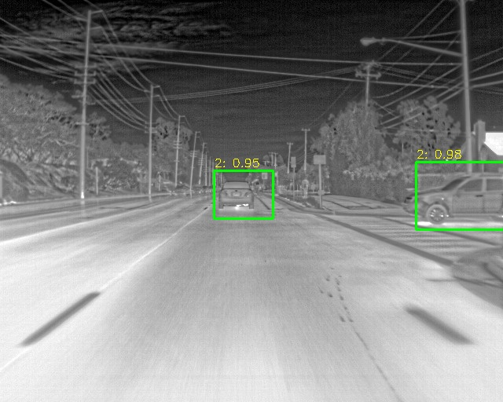

# MobileNetV2 SSD Lite Fine-Tuning

## Overview

This project provides a PyTorch-based pipeline to fine-tune a MobileNetV2 SSD Lite object detection model. The provided code is specifically configured to train on the FLIR ADAS Thermal Dataset (formatted as PASCAL VOC), classifying objects into three categories: `background`, `person`, and `car`. It includes comprehensive data augmentation, custom multibox loss with hard negative mining, and an inference script to test the model on new images.
## Simple Test Image

## Dependencies

Ensure you have Python 3 installed along with the following libraries:

* `torch` and `torchvision`
* `opencv-python` (`cv2`)
* `numpy`
* `matplotlib`
* `Pillow` (`PIL`)
* `scikit-learn`
* `tqdm`
* `pandas`

*Note: This code also relies on a local `vision.ssd` module (likely from the `pytorch-ssd` repository) containing the MobileNetV2 SSD Lite architecture and predictor configurations.*

## Fine-Tune Your Models

The training pipeline is set up to handle PASCAL VOC formatted datasets. To fine-tune the model on your own data:

1. **Prepare your Data:** Ensure your dataset has an `images` folder (containing `.jpg` files) and an `Annotations` folder (containing `.xml` bounding box labels).
2. **Update Paths:** Modify the `dataset_dir_im` and `annotation_dir` variables in the training script to point to your local or Kaggle directories.
3. **Configure Classes:** Update the `VOC_CLASSES` list in the `load_labels` function to match your custom dataset.
4. **Train:** The `train()` function initializes the Adam optimizer and the `MultiboxLoss` criterion. It applies heavy augmentation (photometric distortion, expanding, random cropping, mirroring) to prevent overfitting. Models are saved every 5 epochs to your designated working directory (e.g., `model_{epoch}.pth`).

## Run for Test Fine Tune

Once you have fine-tuned your model, you can evaluate it by running the testing block.

1. **Load the Weights:** Update the `model_path` variable to point to your recently trained `.pth` file.
2. **Initialize Model:** The script sets `is_test=True` and loads the weights into the CPU/GPU via `model.load_state_dict()`.
3. **Create Predictor:** The `create_mobilenetv2_ssd_lite_predictor` wraps the model to handle standard image inputs, candidate selection, and non-maximum suppression (NMS).

## Simple Test Image

To test the model on a single, local image and visualize the bounding boxes:

1. Point the `image_path` variable to your target image (e.g., `image1.jpg`).
2. The predictor will output bounding `boxes`, `labels`, and confidence `probs`.
3. The script uses OpenCV (`cv2`) to draw green bounding boxes and label tags over the detected objects, then displays the final annotated image using `matplotlib`.

```python
# Example inference execution
boxes, labels, probs = predictor.predict(img_test, top_k=2, prob_threshold=0.4)

# Bounding boxes are drawn and displayed automatically via matplotlib
plt.imshow(img_test)
plt.show()

```
